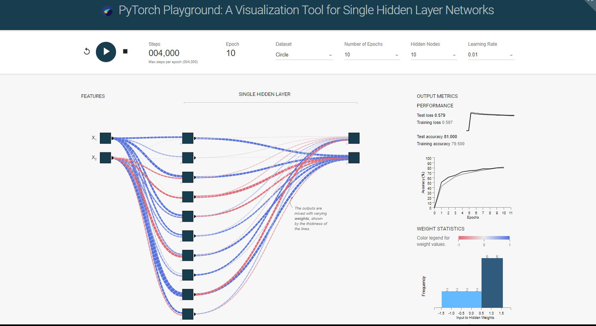

# PyTorch Playground
This visualization tool allows a user to quickly build and observe single 
hidden layer neural networks being trained real-time by a Python script 
in the background. You might notice that the visualization looks familiar 
and that's because the tool was based on the open-source [TensorFlow Playground](https://playground.tensorflow.org) 
by Google! 

Since the original implementation was purely in JS (not TF), it was adapted 
and developed further for Ricardo's MS thesis (2021) to analyze the dynamics
of his proposed learning and pruning algorithms that arise from WiSHNets 
(Wide Single Hidden Layer Neural Networks), typically layers as wide as 100 
to 1000 hidden neurons. All of the network computations are done specifically
with the PyTorch deep learning library. Hence the name, PyTorch Playground.

Please note that this is only a simplified version of the final visualization 
(that will be released later). This was specifically developed only to quickly
demonstrate how a PyTorch training script's output (the neural 
network's internal states) can be visualized real-time with D3.JS. 




## Credits
This is a continuation of many people’s previous works — Daniel Smilkov
and Shan Carter's [TensorFlow Playground](https://playground.tensorflow.org), 
and Andrej Karpathy’s convnet.js [demo](http://cs.stanford.edu/people/karpathy/convnetjs/demo/classify2d.html) 
and Chris Olah’s [articles](http://colah.github.io/posts/2014-03-NN-Manifolds-Topology/) 
about neural networks. 

Just as with research and open-source, feel free to extend this work 
to your own ideas and applications as well. Below are some implementation and 
setup details to get you started.

## Tech Stack
In order to build the intended visualization, the following technologies were used:
- HTML, CSS, & JavaScript
- TypeScript
- Python 3
- D3.JS
- PyTorch
- NodeJS & WebSockets (for continuous stream of network weight updates to the app)

## Setup

### Requirements
- At least Python 3.6
- npm (6.9.0)
- Node.js (10.16.3)

Open up your terminal and run the following commands in the project directory 
to install `npm` package dependencies for the web app.
```buildoutcfg
npm install
```

For the training script, install the Python packages through `pip`.
```buildoutcfg
pip install scripts/requirements.txt
```

### Building
After installing the dependencies, run the command to compile the app. 
It will produce all the web files in the `dist/` directory.
```buildoutcfg
npm run build
```

## Running the Visualization
Finally, to run the visualization tool on your machine, simply run the 
command below. It will create a server and open a browser tab automatically.
```buildoutcfg
npm start
```
